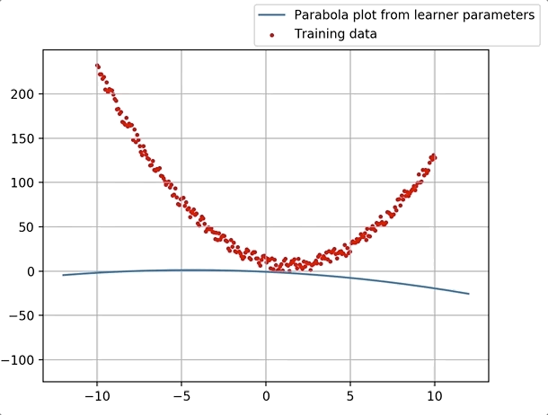
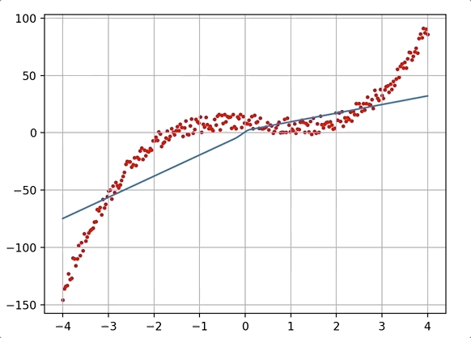

# how-to-tensorflow
##### Learning tensorflow by exploring documentation and writing "hello-world" examples.

***

### How to use it?

- Each .py file is a short teaching example of particular tensorflow API element. Get familiar with basic tf-idiomatic syntax.
- run ```jupter notebook``` in project root directory to play with interactive notebooks.


****

## Notebooks:

#### 1. Linear regression
Applied mean squered error cost function to learn coefficients of quadratic function



#### 2. Polynomial estimator using neural network (dense, fully conected)
Neural net fits nth degree polynomial equation.


